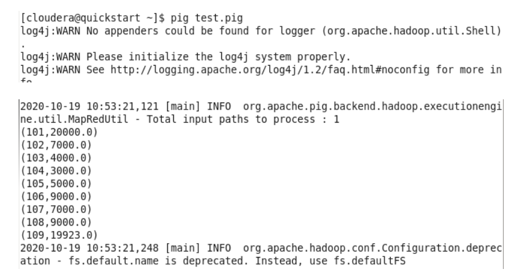
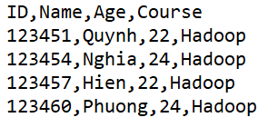

# HDFS

Thêm file vào HDFS

    //Trước tiên phải cd đến thư mục có chứa file cần thêm
    hdfs dfs -put file_name.ext

Kiểm tra thư mục hdfs:

    hdfs dfs -ls

Xóa đối tượng trong thư mục hdfs:

    hdfs dfs -rm -r name.ext

# MySQL

Khởi động Mysql:

    mysql -u root -p

Tạo "StudentInfo":

    create database StudentInfo;

Tạo bảng và thêm dữ liệu vào "StudentInfo":

    use StudentInfo;
    create table student(std_id integer, std_name varchar(43));
    insert into student values (101, 'le'), (102, 'pham'), (103, 'tran'), (104, 'ngo'), (105, 'vu'), (106, 'dao');

Xóa bảng:

    drop table table_name;

# Sqoop

Dưới đây là một số lệnh cơ bản, các lệnh truy vấn cũng như import được hỗ trợ sinh tự động bằng file [script_generator.ipynb](./script_generator.ipynb).

Show all databases:

    sqoop list-databases --connect jdbc:mysql://localhost/ --username root --password cloudera

Show all tables in database:

    sqoop list-tables --connect jdbc:mysql://localhost/StudentInfo -- username root --password cloudera

Import all tables to hdfs:

    sqoop import-all-tables --connect jdbc:mysql://localhost/StudentInfo --username root --password cloudera --m 1

# Pig

Load data from HDFS into Pig relation

    employee = load 'employeeDetails.txt' using PigStorage(' ') as (id:int, name:chararray,salary:float,task:chararray);

Describe:

    describe employee;

Dump:

    dump employee;

Lưu Relation vào HDFS:

    store relation_name into '/user/cloudera/relation_name' using PigStorage(',');

Lưu Relation vào Hive table:

    // Phải tạo table trong Hive trước
    store relation_name into 'table_name' using org.apache.hive.hcatalog.pig.HCatStorer();

Pig script:

# Hive

Khởi động hive:

    hive

Tạo và hiển thị tất cả databases

    create database newdb;
    show databases;

Có 2 loại bảng trong Hive:

- **managed table:** lúc load là chuyển ra, drop là mất hết.
- **external table:** lúc load là lưu trong warehouse, drop vẫn còn trong warehouse.

Tạo managed table:

    create table employee (ID int, name string, salary float, age int);
    describe employee; //xem mô tả table
    describe formatted employee; //xem mô tả table
    // thêm "row format delimited fields terminated by ','" nếu load data từ csv
    // thêm "tblproperties('skip.header.line.count'='1')" nếu file csv có headlines

Tạo external table:

    create external table employee2 (ID int, name string, Salary float, Age int);

Kiểm tra hive warehouse:

    hdfs dfs -ls /user/hive/warehouse

Đổi tên table:

    alter table table_name rename to new_name;

Thêm cột:

    alter table table_name add columns (surname string);

Load data from local to hive:

    LOAD DATA LOCAL INPATH '/home/cloudera/Desktop/Employee.csv' INTO TABLE employee;

Load data from HDFS to hive;

    LOAD DATA INPATH 'Student.csv' INTO TABLE student;

**Partition**:
Hive organizes tables into partitions for grouping similar type of data together based on
a column or partition key. Each Table can have one or more partition keys to identify a
particular partition. This allows us to have a faster query on slices of the data.

Tạo bảng với static partition:

    create table student (ID int, Name string, Age int) partitioned by (Course string);
    // thêm "row format delimited fields terminated by ','" nếu load data từ csv
    // thêm "tblproperties('skip.header.line.count'='1')" nếu file csv có headlines

Import dữ liệu vào từng partition tương ứng:

- File [StudentHadoop.csv](./slide%20and%20data/Hive%20dataset%20-%20Slide%205/Hive%20dataset%20-%20Slide%205/StudentHadoop.csv)

    // chỉ file load vào partition Hadoop
    load data local inpath '/home/cloudera/Desktop/StudentHadoop.csv' into table student(course="Hadoop");
    // Continue to load data to other partition

Thiết lập Dynamic Partition:

    set hive.exec.dynamic.partition=true;
    set hive.exec.dynamic.partition.mode=nonstrict;

    // Tạo bảng và load dữ liệu như bình thường sau đó

    // Tạo thêm bảng partition
    create table student_partition (ID int, Name string, Age int) partitioned by (Course string);
    // thêm "row format delimited fields terminated by ','" nếu load data từ csv
    // thêm "tblproperties('skip.header.line.count'='1')" nếu file csv có headlines

    // Thêm dữ liệu vào bảng partition vừa tạo
    insert into student_partition partition(Course) select ID, Name, Age, Course from student;

# Hue

Xem [Slide 5](./slide%20and%20data/Slide%205%20High-Level%20Data%20Process%20Components%20Tutorial.pdf) từ trang 86 trở đi.
